# Setting up Beeper account

1. Head to beeper.com and install the client for your OS.
    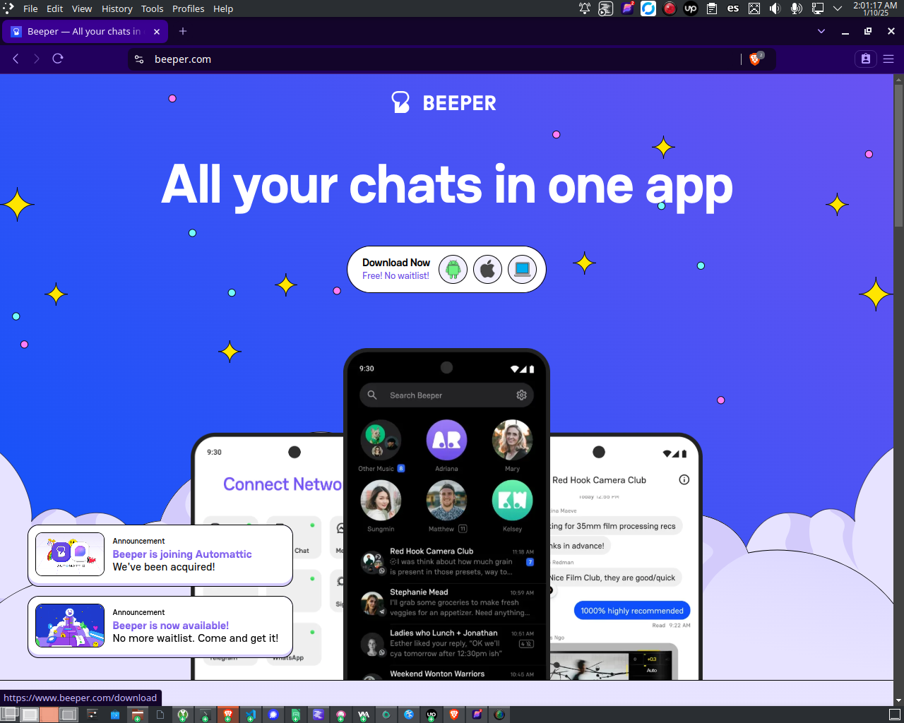
    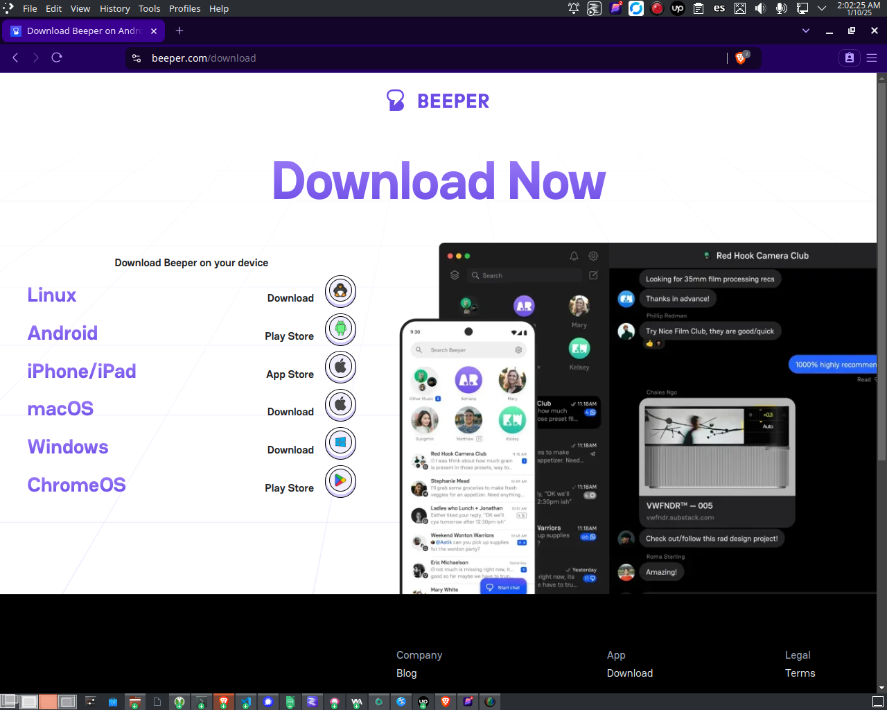

2. Launch the client. It will ask you to create an account if you don't have one. 
    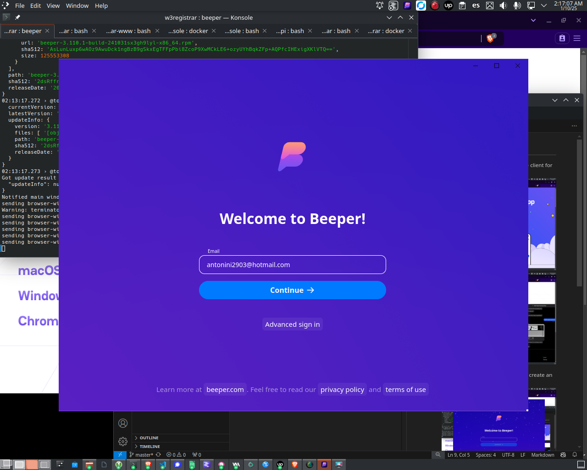

3. Reviow your email inbox for a 6-digit verification code.
    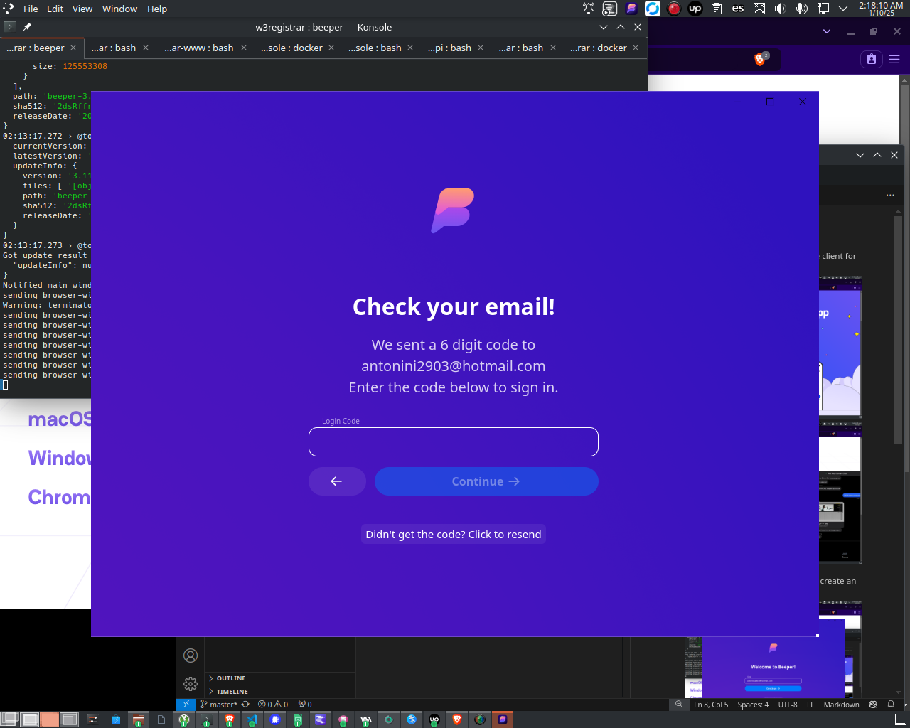
    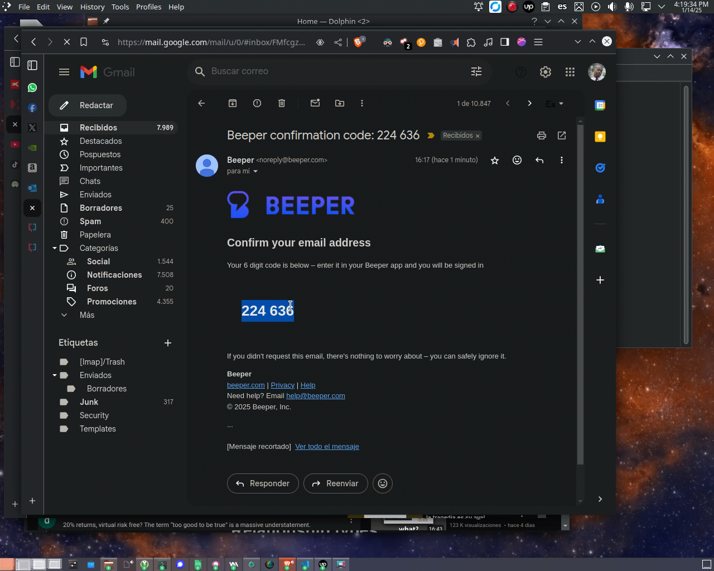

4. Create a username by specifying it, and setting first and last names.

5. Read and the rest of instructions carefully:
    
    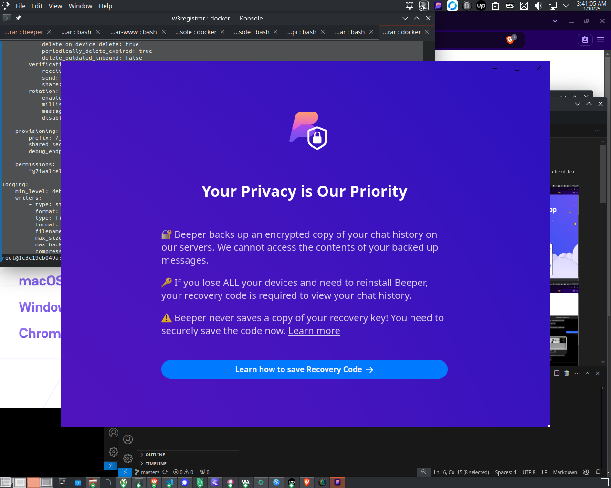

6. Copy and paste your secret key, which will be needed in order to decrypt messages. 
    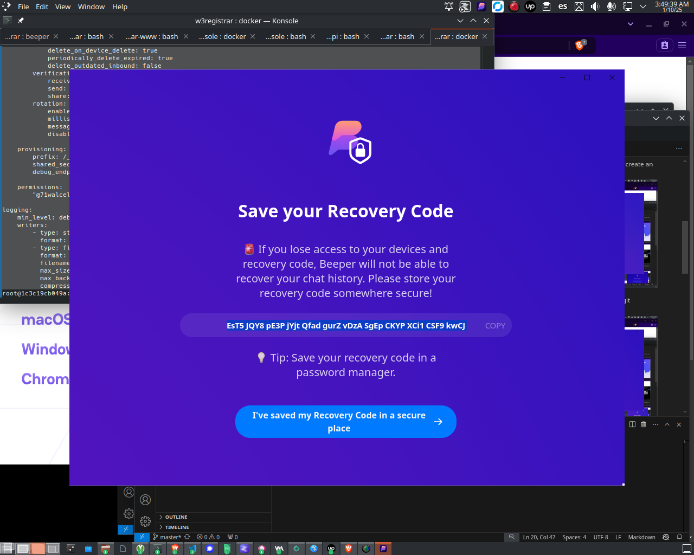

7. Pasth given secret key, in order to make sure that it was correctly copied.
    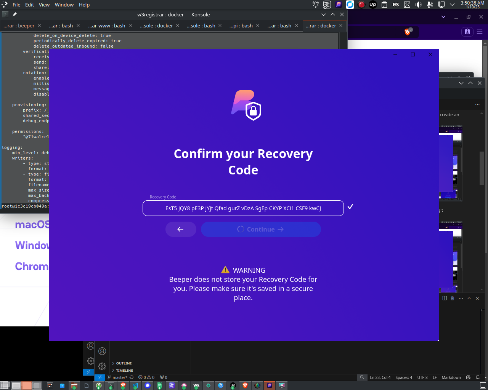
    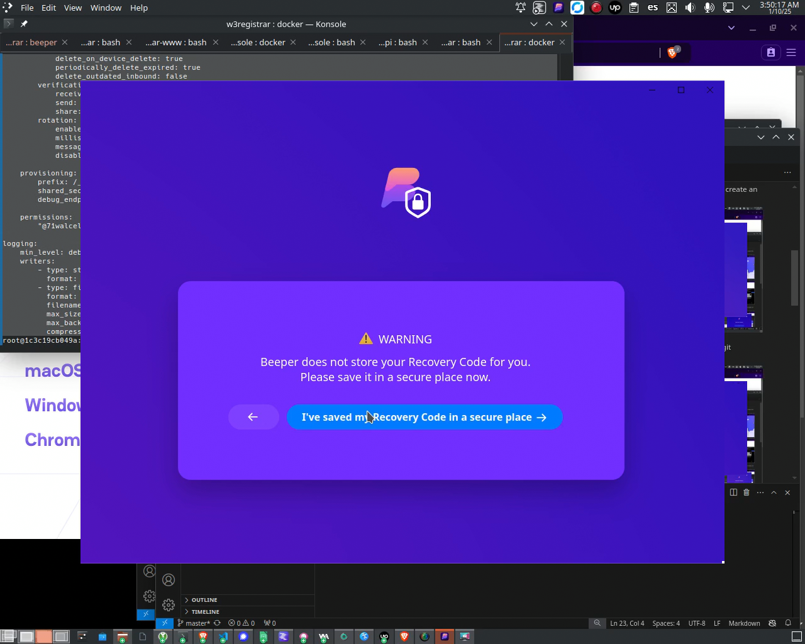

    **Warning**: If missed, you might not be able to recover messages when you log back in. 
    **Warning**: Recovery key will not be stored by beeper.com. 

8. You'll be prompted to sync your contacts by connecting your Google account. You can skip this step as it's not necessary in order to bridge messages.

9. Select all apps to be connected. In this case, we set up Discord. 
    
    

10. Log in to Discord Web interface, and authorize Beeper app.
    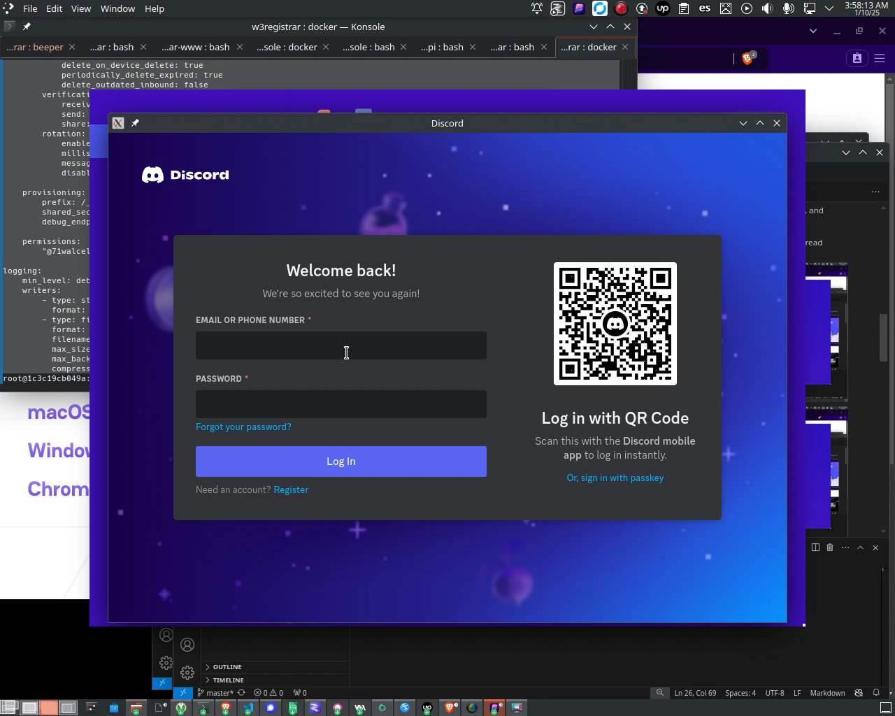
    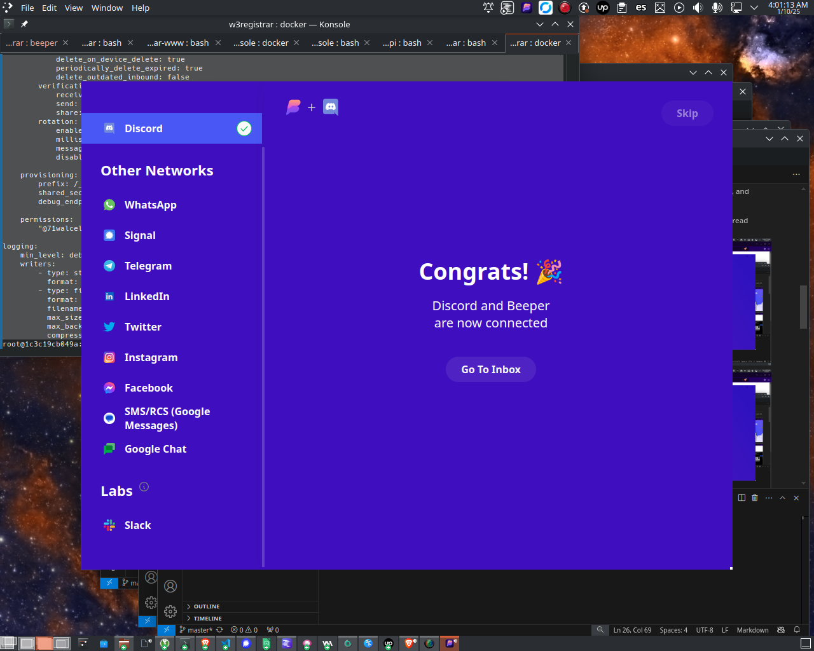

11. Once completed the steps, go through the rest of the steps until you get to the imbox.

We've advanced a lot, but not done yet. A couple more steps, and you'll be done. In order to be able to use it, the password must be changed.

12. Go to [Element]([app.element.io](https://app.element.io/#/login)) and click *Edit*, besides *matrix.org*.
    

13. Set HomeServer to `beeper.com`.
    

14. Since Beeper does not allow to set up password or give one, it must be set. Click *Forgot password?*, Then enter the email used to set up Beeper account.
    

15. Look for an email from Beeper containing verification link, to aotuorize passwork change..
    

16. Click on the link to verify your email. Then click *Continue*. 
    
    
    

17. Go back to Element and click *Next*. Then set a password. Clock *Continue*.
    
    

-----

After all that, you'll finally be ready to hook up Discord or Twitter/X through the bridges!
- [Discord Bridge](discord.md)
- [X Bridge](twitter.md)
