# Introduction
...

## 1. Setting up Discord Bridge
1. Install `bbctl` binary by downloading from the server.
    

2. Set executable permission so that `bbctl` will be able to run. `chmod +x ./bbctl`

3. Log in by supplying email and auth code sent to it. 
    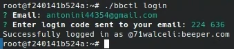

4. Start a Discord bot instance by tunning `./bbcth run sh-discordgo`
    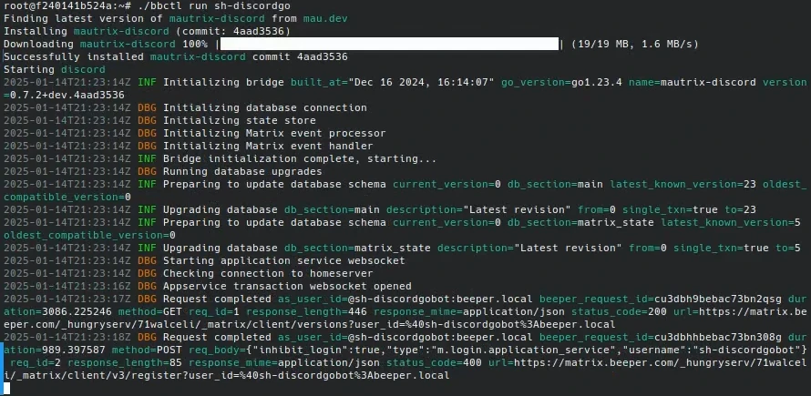

## 2. Creating server
In order to perform registration, it's necessary to create a server and channel, so users can get the challenges.

1. Head to [Discord app](discord.com). Click on the `+` to the left. Choose *Create My Own*, no need to use a template. Select *Skip this question*
    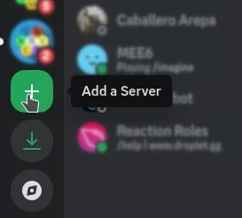
    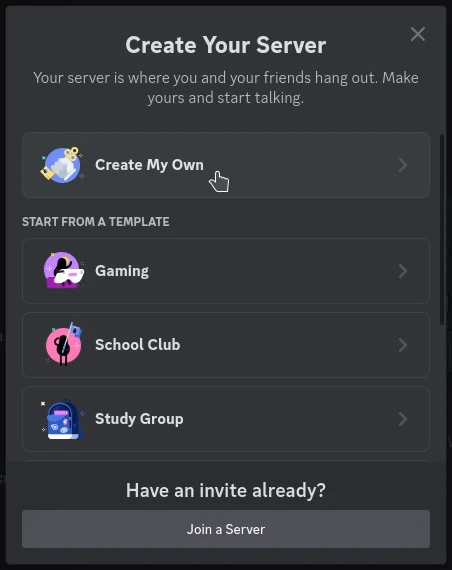
    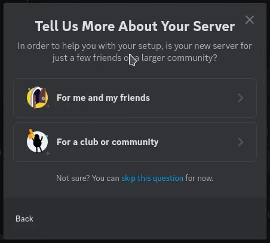

2. Set the server name, and proceed to create it
    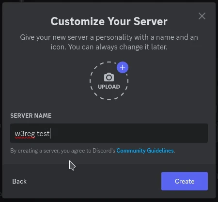

3. Create a channel for users to get their challenges by clicking `+` beside *Text Channels*. Set channel name and proceed.
    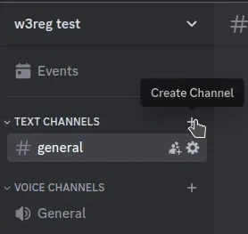
    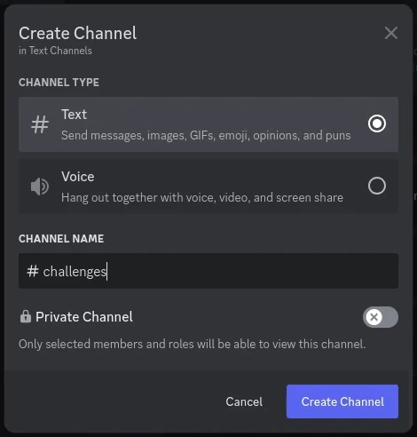

## 3. Creating bot
It is necessary in order to ...

1. Go to [Discord Dev Portal](https://discord.com/developers/applications) and click on *New Application*
    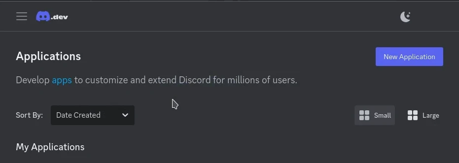

2. Set a name to your server and accept the *Terms of Service*. Click on *Create*
    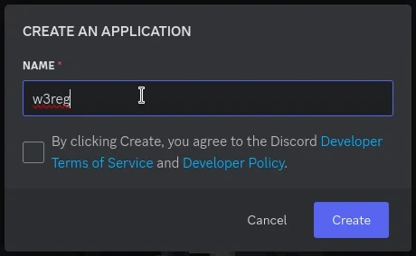

    **note**: You may come across captcha challenges, which you have to complete in order to proceed.

    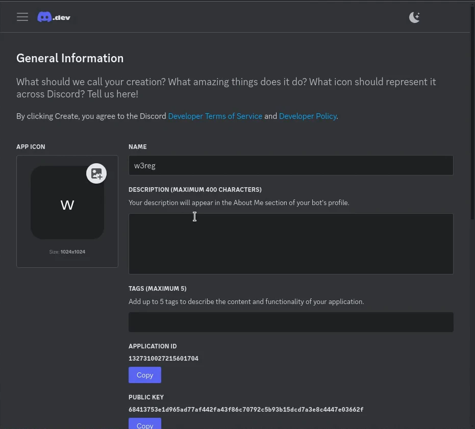

## 4. Adding bot to server
1. Go to *Bots*, scroll down to *Privileged Gateway Intents*, and enable 
    - *Server Members intent*
    - *Message Content intent*

    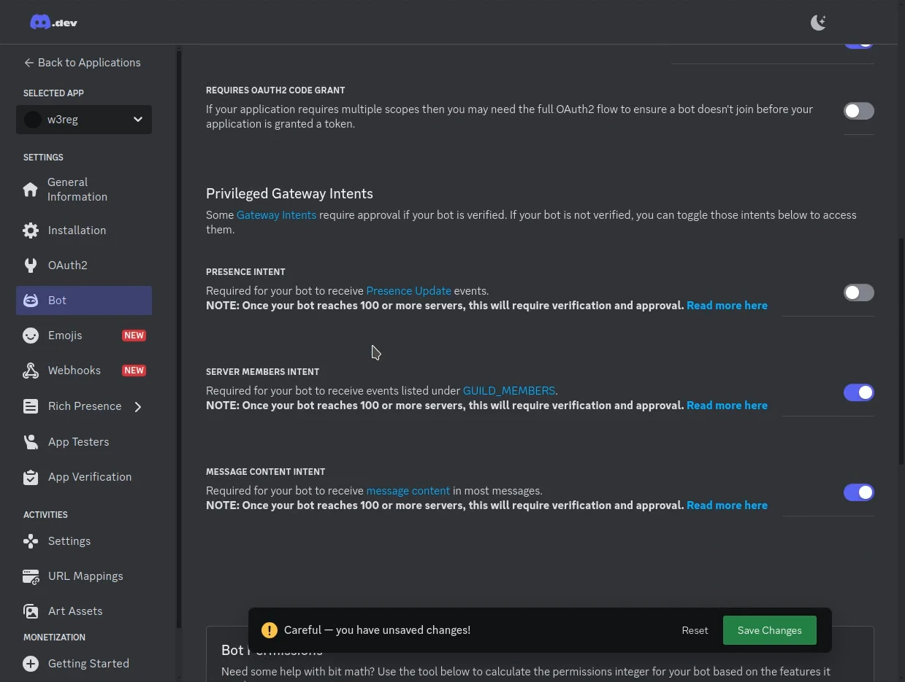

2. Go to *OAuth2*. Scroll down to *OAuth2 URL Generator*, and check *Bot* scope. Set bot permission as *admin*, se bot can actually use the server.
    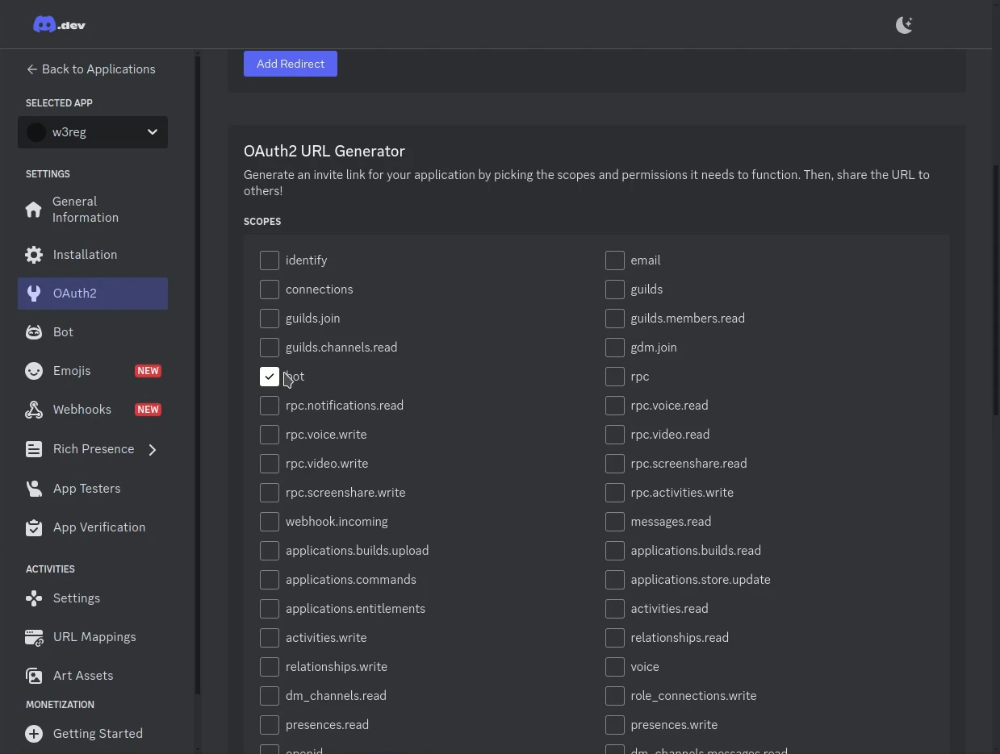
    

    **Important**: Minimun required permissions for the bot:
    - *Send Messages*
    - *Create Public Threads*
    - *Send Messages in Threads*
    - *Read Message History*
    - *Add Reactions*

3. Go to the bottom in order to copy the generated URL and go to it in new tab.
    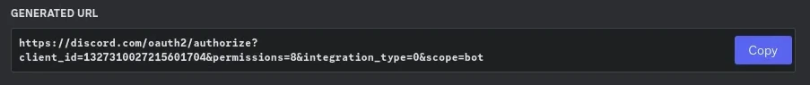
    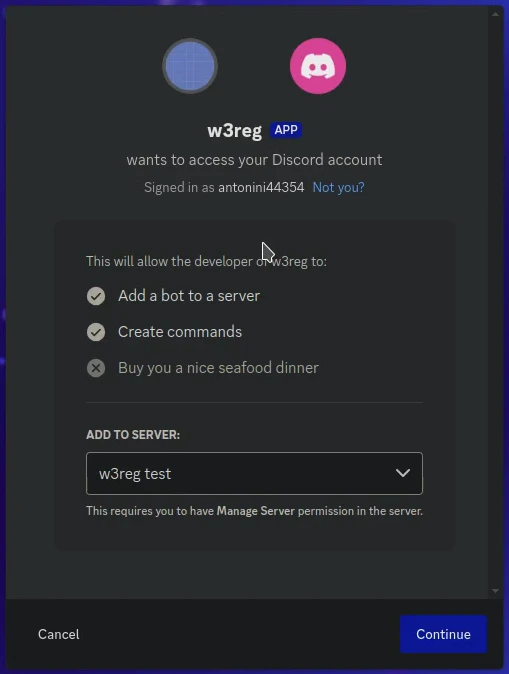

4. Select the registrar server, click *Continue*, and confirm Admin permission.
    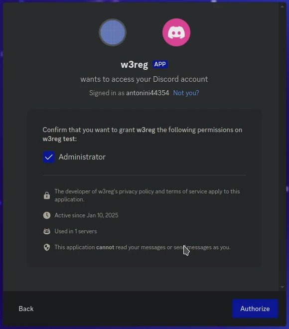
    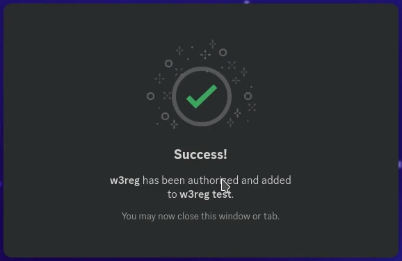

## 5. Bridging Discord server
w3reg API requires a Mastrix channel in order to pass the challenges. In  this case, it will be bridged through Discord

1. Log into [Element](app.element.io/#/login) with your Beeper account.
    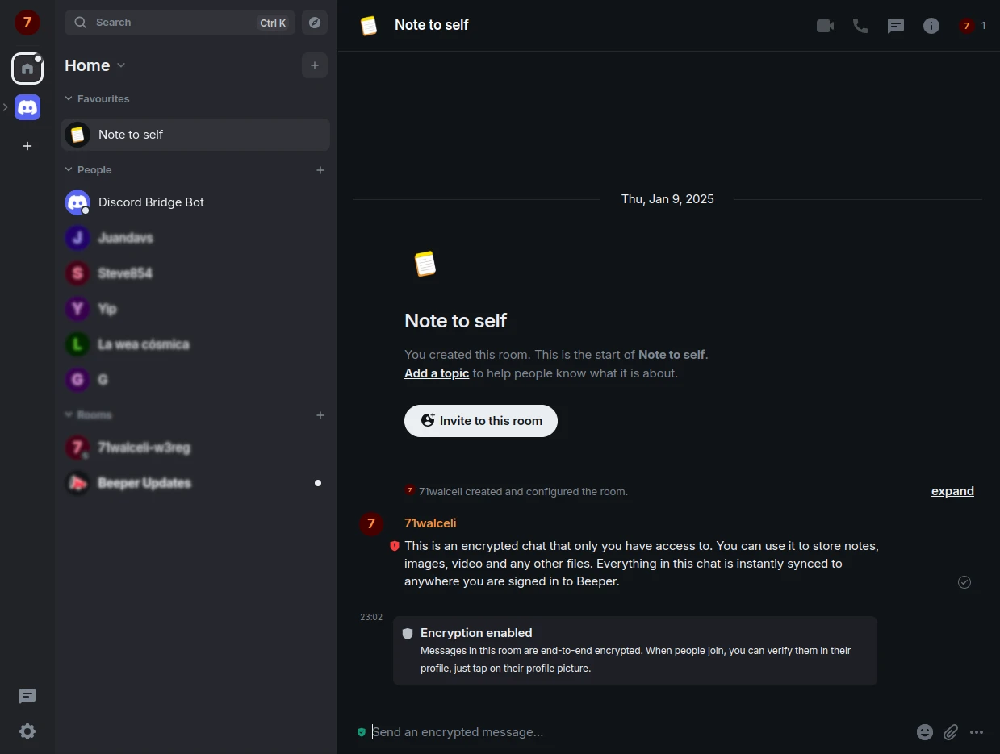

2. In order to find the bot, you need to click `+`, then *Start new chat*. Once you do, you shall see a chat whose domain ends with `beeper.com`. Select the *Discord Bridge Bot*. Then click Go.
    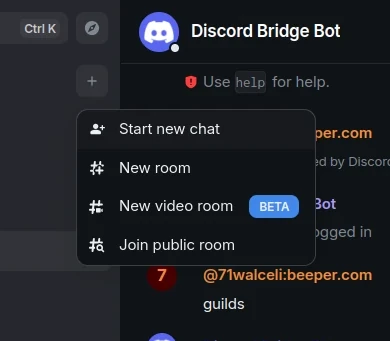
    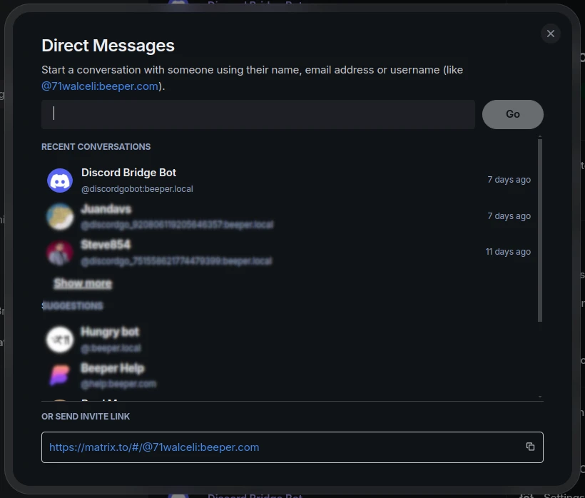

A new chat will be created. To set up the bot, it's necessary to issue commands. Issue commands such as `help` or `guilds` to get help on the chat, as well as to make sure the bot works.
    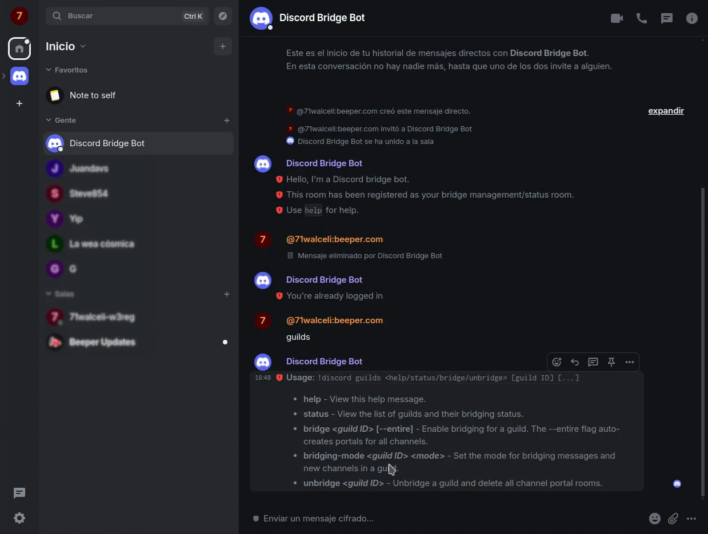

3. Go to Discord new server. Server ID can be gathered from URL. 
    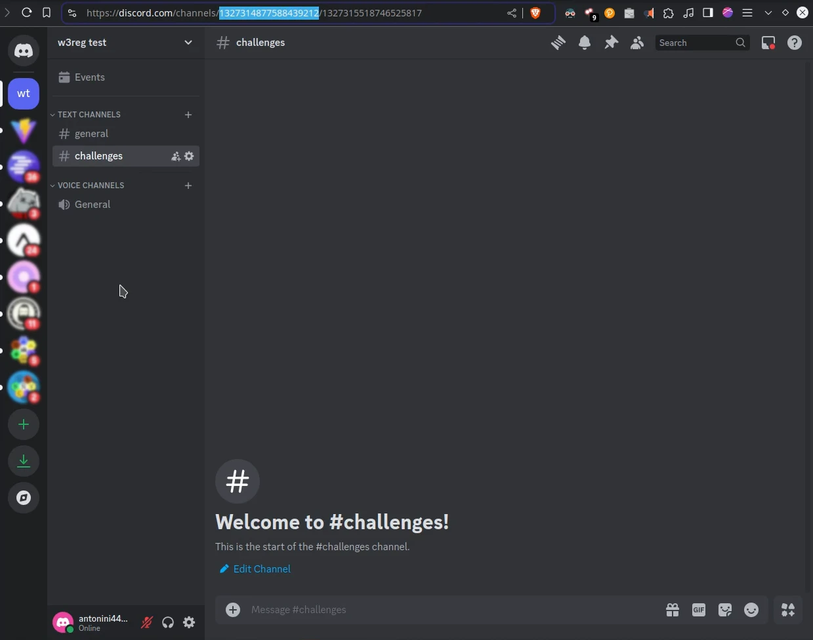

    URL format is `https://discord.com/channels/<server_id>/<channel_id>`

4. Get back to Element Discord bot chat, and issue `guilds bridge <server_id> --entire`
    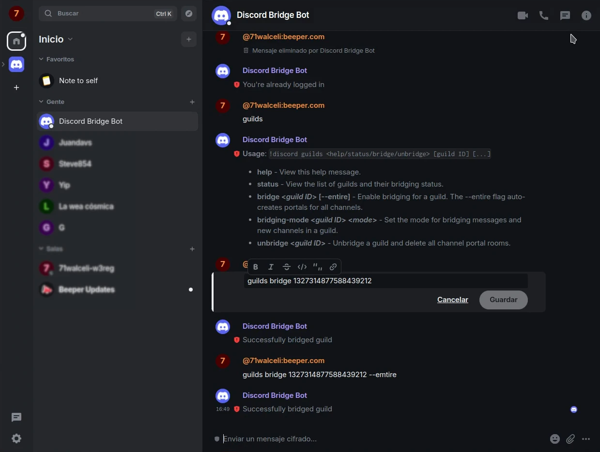

# Conclusion
Congratulations! You have successfully a Discord server into Matrix.

