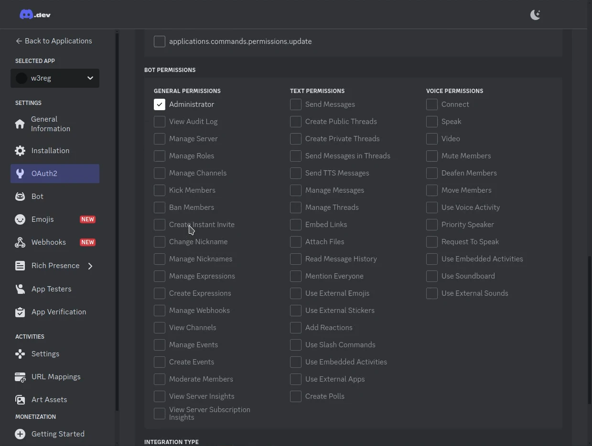

# Introduction
This guide walks you through the process of setting up a Discord Bridge using Matrix. By following these steps, you’ll integrate Discord with Matrix, enabling seamless communication and challenge delivery for the `w3reg` API. This setup allows users to interact with challenges through Discord while benefiting from Matrix’s robust messaging capabilities.

By the end of this guide, you’ll have a functional bot, a bridged Discord server, and a clear understanding of how to manage this integration for w3reg challenges.

## 1. Setting up Discord Bridge
First off, it is imperative to initialize a local bot so that it can automate challenges serving via `w3reg` API.

1. Open a terminal session and download the `bbctl` binary from the server to install it.
    

2. Grant executable permissions to the `bbctl` binary to make it runnable. Use the following command: `chmod +x ./bbctl`

3. Log in by entering your email and the authentication code sent to your email inbox.
    

4. Start a Discord bot instance by running the command: `./bbctl run sh-discordgo`
    

## 2. Creating a Discord Server
To perform registration, it’s necessary to create a Discord server and channel where users can receive challenges.

1. Open the [Discord app](https://discord.com). Click on the `+` icon on the left sidebar. Select *Create My Own*, and skip the template by clicking *Skip this question*.
    
    
    

2. Enter a name for your server and proceed to create it.
    

3. Create a text channel for users to receive their challenges. Click the `+` icon next to *Text Channels*, set a channel name, and complete the creation process.
    
    

## 3. Creating a Bot
Creating a Discord bot is essential for the `w3reg` API to bridge trhough it via Matrix so that it can serve challenge codes to users in this social network.

1. Visit the [Discord Developer Portal](https://discord.com/developers/applications) and click *New Application*.
    

2. Enter a name for your bot and agree to the *Terms of Service*. Click *Create*.
    

    **Note**: You might encounter captcha challenges, which must be completed to proceed.
    

## 4. Adding the Bot to the Server
For the bot to interact with Discord, it needs the right permissions and to be added to newly created server.

1. Navigate to the *Bots* section, scroll down to *Privileged Gateway Intents*, and enable:
    - *Server Members intent*
    - *Message Content intent*

    

2. Go to *OAuth2* and scroll to *OAuth2 URL Generator*. Check the *Bot* scope and set the bot's permissions to *admin* so it can manage the server effectively.
    
    

    **Important**: Minimum required permissions for the bot include:
    - *Send Messages*
    - *Create Public Threads*
    - *Send Messages in Threads*
    - *Read Message History*
    - *Add Reactions*

3. Copy the generated URL at the bottom of the page and open it in a new browser tab.
    
    

4. Select your server from the list, click *Continue*, and confirm the bot's admin permissions.
    
    

## 5. Bridging the Discord Server
The `w3reg` API requires a Matrix channel to pass challenges and bridge to any other nessaging app or social network. This channel will be bridged to Discord.

1. Log into [Element](https://app.element.io/#/login) using your Beeper account.
    

2. To find the Discord Bridge bot, click the `+` icon and select *Start new chat*. Locate a chat domain ending with `beeper.com`, select the *Discord Bridge Bot*, and click *Go*.
    
    

    A new chat window will open. Use commands like `help` or `guilds` to test the bot and ensure it’s working correctly.
    

3. Navigate to your newly created Discord server. The server ID can be extracted from the URL, which follows the format:
    `https://discord.com/channels/<server_id>/<channel_id>`
    

4. Return to the Element Discord bot chat and issue the following command to bridge the server:
    `guilds bridge <server_id> --entire`
    

# Conclusion
Congratulations! You have successfully integrated a Discord server with Matrix using the Discord Bridge. This setup ensures seamless communication for `w3reg` challenge delivery, enabling users to interact with challenges on Discord while maintaining the advantages of Matrix’s secure and decentralized architecture.

By bridging these platforms, you enhance collaboration and streamline the challenge delivery process, making it more accessible for participants across both ecosystems. This integration is a significant step toward leveraging the best of both platforms to meet the needs of modern communication workflows.

