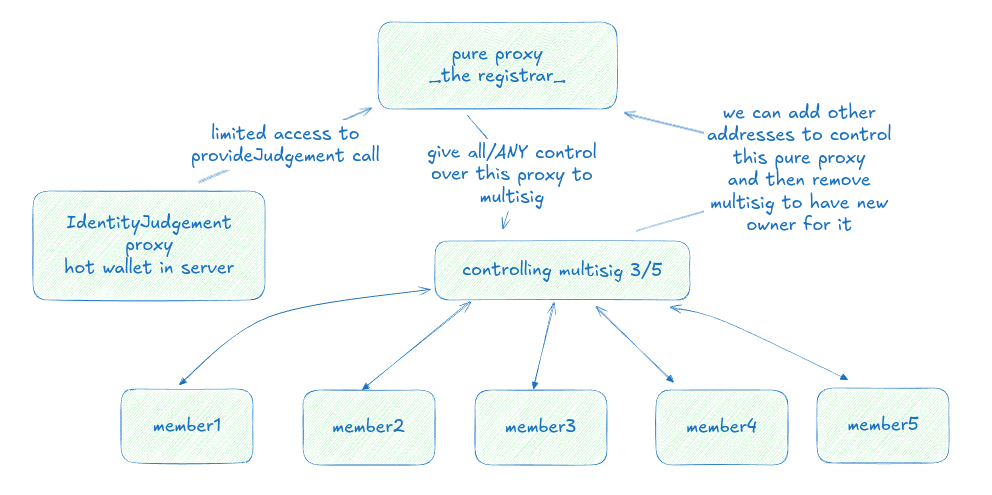

# Secure Registrar Setup Guide

## Core Architecture

The registrar setup consists of three key components:
1. Pure Proxy (Main Registrar) - controlled by multisig, stays cold
2. Multisig - for governance and critical operations only
3. Identity Judgement Proxy - hot wallet for registrar operations

## When to Use Multisig

Multisig is required ONLY for these critical operations:
1. Requesting registrar rights via governance for the pure proxy
2. Setting supported bitflags (declaring which identity fields you verify)
3. Setting up new Identity Judgement proxy

All other operations should use the Identity Judgement proxy.

## Operational Flow

### Initial Setup
1. Create pure proxy (will be your registrar address)
2. Set up multisig (minimum 3/5 recommended)
3. Request registrar rights via governance
4. Set supported identity verification bitflags
5. Create Identity Judgement proxy for server operations

### Daily Operations
- Identity Judgement proxy runs on server
- Provides actual judgements
- Main registrar (pure proxy) stays cold
- No multisig needed for routine judgements

## Security Model



The diagram shows the complete security setup:
- Pure proxy at the top serves as the registrar
- Controlled by a 3/5 multisig
- Identity Judgement proxy connected to server hot wallet
- Members 1-5 participating in multisig operations
- Ownership of registrar can be assigned to new wallet/multisig

## Transaction Review

CRITICAL: Always verify transactions on Polkadot.js Apps:
```
1. Visit: https://polkadot.js.org/apps/?rpc=wss%3A%2F%2Fpeople-paseo.dotters.network#/extrinsics
2. Go to 'Decode' section
3. Paste raw transaction (e.g., 0x2a0400000000000000)
4. Verify ALL parameters
5. When sharing multisig calldata, send extrinsics link for easier verification
```

## Multisig Changes

IMPORTANT: Multisig membership cannot be changed once created. To handle member changes:
1. Create entirely new multisig with desired members
2. Use old multisig to give control rights to new multisig over pure proxy
3. Use new multisig to remove old multisig's rights

This is why we use pure proxy as registrar - it allows changing the controlling
multisig while maintaining the same registrar identity.

## Common Operations

### Setting Up Judgement Proxy
1. Create new proxy for Identity Judgement
2. Use multisig to authorize it
3. Verify setup via transaction decode

### Providing Judgements
1. Use Identity Judgement proxy
2. No multisig required
3. Server can operate autonomously

### Changing Supported Fields
1. Requires multisig
2. Update bitflags via pure proxy
3. Verify via transaction decode
